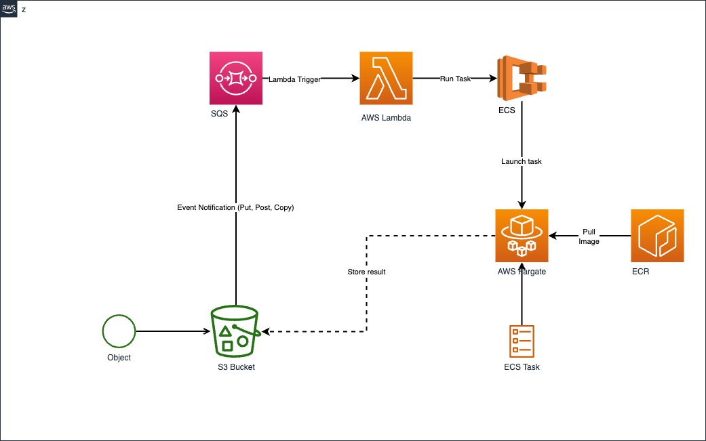

# Event-driven architecture using ECS-Fargate

## Architecture



## Prerequisites

1. [AWS account with admin permissions](https://aws.amazon.com/)
2. [AWS Command Line Interface (AWS CLI)](https://aws.amazon.com/cli/)
3. [Terraform](https://developer.hashicorp.com/terraform/downloads)

## Usage

```terraform
terraform init

terraform plan

terraform apply
```

## Cleanup

```terraform
terraform destroy
```
